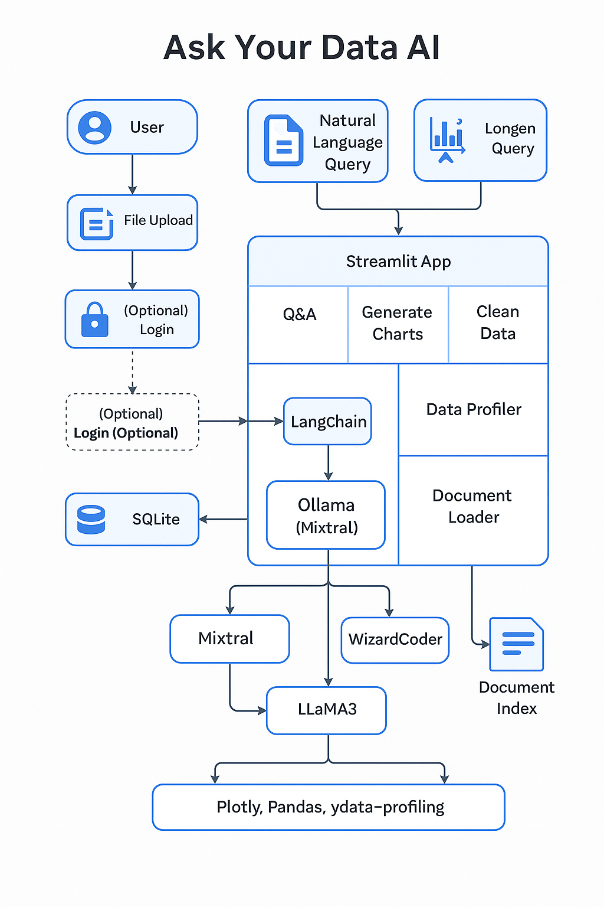

## 🧠 Ask Your Data AI – Architecture plan (Will change once we start)

This advanced AI system enables users to upload datasets (CSV, Excel, JSON, Parquet) and interact through natural language to:

- Ask questions → get SQL-powered answers
- Generate visualizations using Plotly
- Clean the data with pandas using instructions
- Automatically profile and summarize datasets
- All of this runs locally via open-source LLMs using **Ollama + LangChain**

---

### 📊 Architecture Diagram



---

### 🔄 Component Overview

| Stage                                | Component                              | Description                                                               |
| ------------------------------------ | -------------------------------------- | ------------------------------------------------------------------------- |
| **1. User Input**              | **File Upload**                  | Users upload datasets in CSV, Excel, JSON, or Parquet format              |
| **2. Streamlit App**           | **Interface & Pages**            | The Streamlit app provides tabs/pages: Q&A, Charting, Cleaning, Profiling |
| **3. LangChain Orchestration** | **LangChain**                    | Manages prompts, routes input to the correct LLM based on user action     |
| **4. Ollama Runtime**          | **Ollama (Mixtral)**             | Executes LLM locally using models like Mixtral, CodeLlama, WizardCoder    |
| **5. SQLite + Pandas**         | **Data Backend**                 | Uploaded data is stored in SQLite or Pandas for querying/manipulation     |
| **6. Task-Specific LLMs**      | **Mixtral, WizardCoder, LLaMA3** |                                                                           |

- `Mixtral`: for general Q&A & SQL
- `CodeLlama`: for Plotly/Python chart code
- `WizardCoder`: for Pandas cleaning logic
- `LLaMA3`: fallback model |
  | **7. Document Q&A (Optional)** | **Document Loader + Index** | If users upload documents (e.g., policy PDFs), LangChain builds a vector index to answer questions |
  | **8. Output Rendering** | **Plotly, Pandas, ydata-profiling** | Used to show charts, summaries, and data transformations |

---

### 🔁 Example Flows

#### 💬 Ask a Question

```
User → Natural Language Query → LangChain → Mixtral (via Ollama) → SQL → SQLite → Answer → Streamlit
```

#### 📊 Generate a Chart

```
User → Chart Request → LangChain → CodeLlama → Python Code → Plotly → Chart → Streamlit
```

#### 🧹 Clean the Data

```
User → Cleaning Instruction → LangChain → WizardCoder → pandas Code → DataFrame Update → Streamlit
```

#### 📑 Profiling

```
Streamlit → ydata-profiling → Profiling Report → Render in app
```
